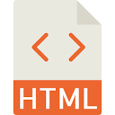

# Welcome to WebDev Basics 19.1
 

## HTML:5 Workshop by DSC JIIT NOIDA

## Introduction
**Hypertext Markup Language**  (**HTML**) is the standard markup language for documents designed to be displayed in a web browser. It can be assisted by technologies such as Cascading Style Sheets (CSS) and scripting languages such as JavaScript.

Web browsers receive HTML documents from a web server or from local storage and render the documents into multimedia web pages. HTML describes the structure of a web page semantically and originally included cues for the appearance of the document.

## Topics covered
 - HTML Basic Tags
 - HTML Tables/Frames
 - HTML Multimedia
 - HTML Forms
 
 ## Contributing & PR
 Before contributing to the project make sure to read the [Contributing Guidelines.](/Contributing.md) 

## Contributors
 - Shreyansh Varshney [Github](https://github.com/shreyanshvarshney)
 - Jai Parakh [Github](https://github.com/JaiParakh/)
 - N Pawan Kumar [Github](https://github.com/npawan98)
 - Rafid [Github](https://github.com/Rafid-009)
